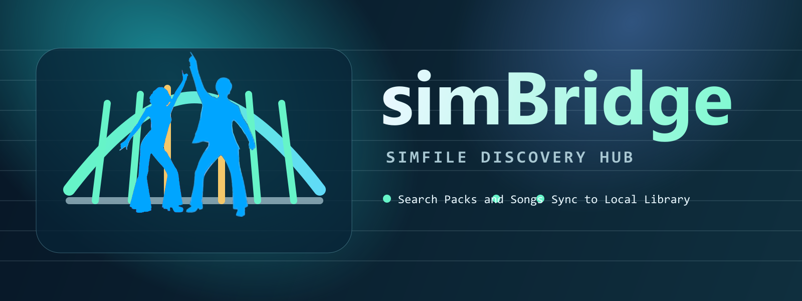

  

  

# simBridge

A desktop app for simfiles that keeps things simple:

- Search songs from ZIv and Stepmania packs
- Preview details before you grab anything
- Download and unzip directly into your Songs library
- See what is already installed so you avoid duplicates

## What You Need

- Internet access to ZIv and Stepmania Online
- A local Songs folder (example: `C:/Games/ITGmania/Songs`)

## How To Use

- Use source chips to switch between `zIV Songs` and `Stepmania Packs`.
- Use category chips to browse latest/top feeds on ZIv.
- Use `Details` for chart and quality info.
- Use `Download` to fetch and unzip directly to your Songs library.
- Use `Settings` -> `Browse...` to pick your Songs folder with the native system dialog.

## Notes

- simBridge pulls metadata and downloads from third-party services.
- Availability and page structure on source sites can change over time.
- Download speed depends on source host response and file size.

## Troubleshooting

- If the app opens but nothing loads, refresh and try again in a few seconds.
- If downloads fail, re-check your Song Library path in settings.
- If search returns no results, broaden the song title/artist query.

## Credits

- Data sources:
  - [ZIv (Zenius -I- vanisher)](https://zenius-i-vanisher.com/v5.2/)
  - [Stepmania Online](https://stepmaniaonline.net/)
- Brought to YOU by: [The Company of Wolves](https://thecompanyofwolves.com)
